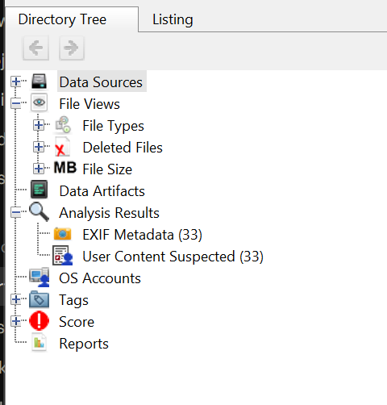
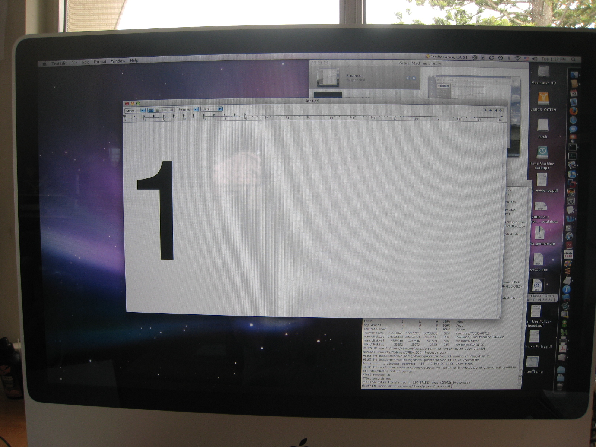

# Digital Forensics Projects

Hands-on digital forensics practice by **Lucky Gurjar**. Each project is a short, documented case with tools, steps, findings and limitations.

## Project 1: Forensic Analysis of a Camera Memory Card Image

A practice investigation of a Canon camera memory card image using **Autopsy**. The goal was to identify the device, read photo metadata (EXIF), and find deleted images and check whether they can be recovered.

**Full report:** [Project 1 report (PDF)](https://github.com/luckybhati9927-del/Digital-Forensics-Projects/raw/main/report/Lucky_Gurjar_Digital_Forensics_Report.pdf)

| Item | Details |
|---|---|
| Image | `nps-2009-canon2-gen3.E01` (EnCase E01 disk image) |
| Source | [Digital Corpora](https://digitalcorpora.org/) public forensic practice corpus (nps-2009-canon2) |
| MD5 | `9B1F461C0F16A9703DAC74B327A54694` |
| Device (from EXIF) | Canon PowerShot SD800 IS |

The evidence image is not included in this repository. It is a public training image and can be downloaded from the source above. The hash was recorded after download and before analysis.

### Tools

- Autopsy (disk image analysis, EXIF parsing, deleted file review)
- Windows PowerShell `Get-FileHash` (evidence hashing)
- Ingest modules: File Type Identification, Extension Mismatch Detector, Hash Lookup, Exif Parser, Embedded File Extractor

### Method

1. Downloaded the image and calculated its MD5 hash before opening it.
2. Created a case in Autopsy and added the `.E01` file as a disk image data source.
3. Ran the ingest modules.
4. Reviewed **Analysis Results > EXIF Metadata** and **File Views > Deleted Files**.
5. Recorded file names, paths and sizes, and checked metadata and previews.
6. Documented findings, limitations and a chain of custody note in the report.

### Key Findings

- **33 images** with EXIF metadata, taken with a Canon PowerShot SD800 IS on 23 Dec 2008 (14:12:38 to 14:26:13 as displayed by Autopsy).
- **5 deleted image entries** found:

| # | File | Location | Size (bytes) | Preview |
|---|---|---|---|---|
| 1 | `_MG_0037.JPG` | `/vol_vol2/DCIM/100CANON/` | 1,347,778 | Not available |
| 2 | `_MG_0025.JPG` | `/vol_vol2/DCIM/100CANON/` | 791,333 | Not available |
| 3 | `_MG_0030.JPG` | `/vol_vol2/DCIM/100CANON/` | 867,833 | Not available |
| 4 | `_MG_0035.JPG` | `/vol_vol2/DCIM/100CANON/` | 820,105 | Not available |
| 5 | `f0000000.jpg` | `/vol_vol2/$CarvedFiles/1/` | 855,935 | Displayed |

- **1 image recovered** (`f0000000.jpg`). It was found by file carving (searching raw data for JPEG signatures), not through the normal file table. It shows a photo of a computer monitor with a TextEdit window displaying the digit "1".
- Content of the other four deleted files could not be previewed in Autopsy.

### Screenshots

| Autopsy directory tree | Recovered image |
|---|---|
|  |  |

### Limitations

- Only Autopsy was used. The four non-previewable files may be recoverable with other tools or may be partly overwritten; this was not tested.
- Timestamps are shown as displayed by Autopsy with an India time zone setting. Cameras store local time without a time zone, so the real time zone is unknown, and the camera clock may not be accurate.
- The hash was not compared with a published value.

### Skills Demonstrated

Evidence hashing and integrity, disk image analysis, EXIF metadata analysis, deleted file identification, file carving, forensic report writing, chain of custody documentation.

## Project 2: Network Traffic Analysis of an HTTP Capture

Analysis of a public Wireshark training capture (`http.cap`) of a web browsing session, using **Wireshark**.

**Full report:** [Project 2 report (PDF)](https://github.com/luckybhati9927-del/Digital-Forensics-Projects/raw/main/project2-wireshark/Lucky_Gurjar_Wireshark_Report.pdf)

### Evidence

| Item | Details |
|---|---|
| File | `http.cap` (pcap, Ethernet, 25 kB) |
| Source | Wireshark Sample Captures (public training file) |
| MD5 | `3346524bd119b437166186b83935ad67` |
| SHA-256 | `25a72bdf10339f2c29916920c8b9501d294923108de8f29b19aba7cc001ab60d` |

### Tools

- Wireshark (packet list, Capture File Properties, Protocol Hierarchy, Conversations, display filters)
- Windows PowerShell `Get-FileHash`

### Key Findings

- **43 packets** over 30.4 seconds (41 TCP, 2 UDP/DNS, 4 HTTP), captured on 13 May 2004.
- **3 conversations** with the client 145.254.160.237: a web server (65.208.228.223), a DNS server (145.253.2.203) and a Google ad server (216.239.59.99).
- **DNS:** the client looked up `pagead2.googlesyndication.com` (packets 13 and 17).
- **HTTP:** `GET /download.html` from `www.ethereal.com` (packet 4) and a Google ad request (packet 18). Both returned `200 OK`.
- **One TCP spurious retransmission** (packet 36) with a duplicate ACK (packet 37). This is normal network behaviour, not an attack.
- No signs of malicious activity were observed.

### Limitations

- Follow TCP Stream was not used, and the gzip-compressed ad response was not decompressed.
- Wireshark shows times in the examiner's local time zone (IST).
- This is a public training capture, so the findings do not describe a real incident.

### Skills Demonstrated

Packet capture analysis, protocol and conversation analysis, DNS and HTTP analysis, display filters, TCP anomaly identification, evidence hashing, forensic report writing.

## Planned Next Projects

- Evidence acquisition and hash verification with FTK Imager
- Metadata and email header analysis
- A combined mini case report

## Disclaimer

All analysis was done on public training data meant for forensic practice. No real person's private data was used.
